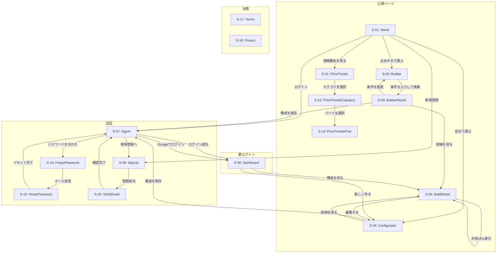
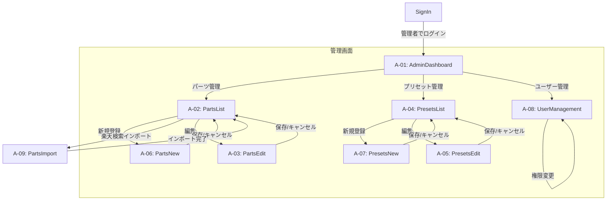
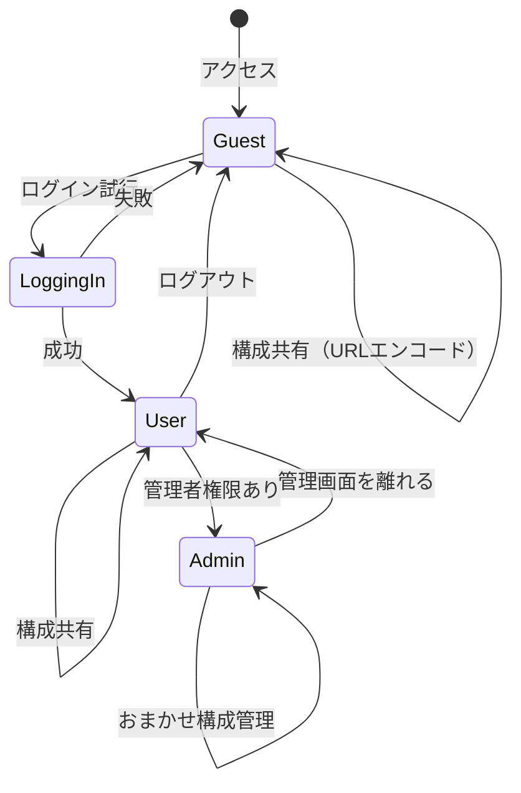

# 画面遷移図

## 1. 画面一覧

### 1.1 ユーザー向け画面

| ID | 画面名 | URL | コンポーネント |
|----|--------|-----|---------------|
| S-01 | トップページ | `/` | `page.tsx` |
| S-02 | おまかせ構成 | `/builder` | `page.tsx` |
| S-03 | おまかせ結果 | `/builder/result` | `page.tsx` |
| S-04 | カスタム構成 | `/configurator` | `page.tsx` |
| S-05 | 構成詳細 | `/builds/[id]` | `page.tsx` |
| S-06 | ダッシュボード | `/dashboard` | `page.tsx` |
| S-07 | ログイン | `/signin` | `page.tsx` |
| S-08 | 新規登録 | `/signup` | `page.tsx` |
| S-09 | 共有構成（クエリパラメータ方式） | `/share?c=...` | `page.tsx` + `opengraph-image.tsx` |
| S-10 | 共有構成（トークン方式） | `/share/[token]` | `page.tsx` + `opengraph-image.tsx` |
| S-11 | 価格動向一覧 | `/price-trends` | `page.tsx` |
| S-12 | カテゴリ別価格動向 | `/price-trends/[category]` | `page.tsx` |
| S-13 | パーツ別価格動向詳細 | `/price-trends/[category]/[partId]` | `page.tsx` |
| S-14 | パスワードリセットリクエスト | `/forgot-password` | `page.tsx` |
| S-15 | 新パスワード設定 | `/reset-password` | `page.tsx` |
| S-16 | メール確認 | `/verify-email` | `page.tsx` |
| S-17 | 利用規約 | `/terms` | `page.tsx` |
| S-18 | プライバシーポリシー | `/privacy` | `page.tsx` |

### 1.2 管理者向け画面

| ID | 画面名 | URL | コンポーネント |
|----|--------|-----|---------------|
| A-01 | 管理ダッシュボード | `/admin` | `page.tsx` |
| A-02 | パーツ一覧 | `/admin/parts` | `page.tsx` |
| A-03 | パーツ編集 | `/admin/parts/[id]` | `page.tsx` |
| A-04 | プリセット一覧 | `/admin/presets` | `page.tsx` |
| A-05 | プリセット編集 | `/admin/presets/[id]` | `page.tsx` |
| A-06 | パーツ新規登録 | `/admin/parts/new` | `page.tsx` |
| A-07 | プリセット新規登録 | `/admin/presets/new` | `page.tsx` |
| A-08 | ユーザー管理 | `/admin/users` | `page.tsx` |
| A-09 | 楽天検索パーツインポート | `/admin/parts/import` | `page.tsx` |

---

## 2. 画面遷移図（ユーザー向け）



---

## 3. 画面遷移図（管理者向け）



---

## 4. ユーザーフロー

### 4.1 おまかせ構成フロー（Builder）

**フロー1: 任意のおまかせ構成の保存（未ログイン・アカウント所持済み）**
```
1. Home（トップページ）（http://localhost:3000/）
   ↓ おまかせで選ぶ「Builder」クリック
2. Builder（おまかせ構成）（http://localhost:3000/builder）
   ↓ 予算か用途、または両方のいずれかを選択して「構成を探す」
3. BuilderResult（結果ページ）（例：http://localhost:3000/builder/result?budget=any&usages=gaming）
   ↓ 気に入った構成を「保存」
4. SignIn（ログイン画面）（例：http://localhost:3000/signin?callbackUrl=http%3A%2F%2Flocalhost%3A3000%2Fbuilder%2Fresult%3Fbudget%3Dany%26usages%3Dgaming）
   ↓ 必要情報入力後「ログイン」
5. BuilderResult（結果ページ）（例：http://localhost:3000/builder/result?budget=any&usages=gaming）
   ↓ ログイン後元のページに戻ってくるので先程の気に入った構成を「保存」
6. Dashboard
   → 保存した構成を確認
```

**フロー2: 任意のおまかせ構成の保存（未ログイン・アカウント未所持）**
```
1. Home（トップページ）（http://localhost:3000/）
   ↓ おまかせで選ぶ「Builder」クリック
2. Builder（おまかせ構成）（http://localhost:3000/builder）
   ↓ 予算か用途、または両方のいずれかを選択して「構成を探す」
3. BuilderResult（結果ページ）（例：http://localhost:3000/builder/result?budget=any&usages=gaming）
   ↓ 気に入った構成を「保存」
4. SignIn（ログイン）（例：http://localhost:3000/signin?callbackUrl=http%3A%2F%2Flocalhost%3A3000%2Fbuilder%2Fresult%3Fbudget%3Dany%26usages%3Dgaming）
   ↓ アカウント未所持のため「新規登録」
5. SignUp（新規登録）（例：http://localhost:3000/signup?callbackUrl=http%3A%2F%2Flocalhost%3A3000%2Fbuilder%2Fresult%3Fbudget%3Dany%26usages%3Dgaming）
   ↓ 必要情報入力後「登録する」
6. SignIn（ログイン画面）（例：http://localhost:3000/signin?callbackUrl=http%3A%2F%2Flocalhost%3A3000%2Fbuilder%2Fresult%3Fbudget%3Dany%26usages%3Dgaming）
   ↓ 必要情報入力後「ログイン」
7. BuilderResult（結果ページ）（例：http://localhost:3000/builder/result?budget=any&usages=gaming）
   ↓ ログイン後元のページに戻ってくるので先程の気に入った構成を「保存」
8. Dashboard
   → 保存した構成を確認
```

**フロー3: 任意のおまかせ構成の保存（ログイン済み）**
```
1. Home（トップページ）（http://localhost:3000/）
   ↓ おまかせで選ぶ「Builder」クリック
2. Builder（おまかせ構成）（http://localhost:3000/builder）
   ↓ 予算か用途、または両方のいずれかを選択して「構成を探す」
3. BuilderResult（結果ページ）（例：http://localhost:3000/builder/result?budget=any&usages=gaming）
   ↓ 気に入った構成を「保存」
4. Dashboard（http://localhost:3000/dashboard）
   → 保存した構成を確認
```

### 4.2 カスタム構成フロー（Configurator）

**フロー1: 任意のおまかせ構成の保存（未ログイン・アカウント所持済み）**
```
1. Home（トップページ）（http://localhost:3000/）
   ↓ 自分で選ぶ「Configurator」クリック
2. Configurator（カスタム構成）（http://localhost:3000/configurator）
   ↓ パーツを選択
   ↓ 合計価格を確認
   ↓ 「ログインして保存」クリック
3. SignIn（ログイン画面）（例：http://localhost:3000/signin?callbackUrl=%2Fconfigurator）
   ↓ 必要情報入力後「ログイン」
4. Configurator（カスタム構成）（例：http://localhost:3000/configurator）
   ↓ ログイン後元のページに戻ってくる
   ↓ ログイン前に選択していたパーツが未だあることを確認
   ↓ ログイン前と同じ合計価格であることを再確認
   ↓ 「この構成を保存」クリック
   ↓ 構成名を入力し「保存する」クリック
5. Dashboard
   → 保存した構成を確認
```

**フロー2: 任意のカスタム構成の保存（未ログイン・アカウント未所持）**
```
1. Home（トップページ）（http://localhost:3000/）
   ↓ 「自分で選ぶ」クリック
2. Configurator（カスタム構成）（http://localhost:3000/configurator）
   ↓ パーツを選択
   ↓ 合計価格を確認
   ↓ 「ログインして保存」クリック
3. SignIn（ログイン）（例：http://localhost:3000/signin?callbackUrl=%2Fconfigurator）
   ↓ アカウント未所持のため「新規登録」
4. SignUp（新規登録）（例：http://localhost:3000/signup?callbackUrl=%2Fconfigurator）
   ↓ 必要情報入力後「登録する」
5. SignIn（ログイン画面）（例：http://localhost:3000/signin?callbackUrl=%2Fconfigurator）
   ↓ 必要情報入力後「ログイン」
6. Configurator（カスタム構成）（例：http://localhost:3000/configurator）
   ↓ ログイン後元のページに戻ってくる
   ↓ ログイン前に選択していたパーツが未だあることを確認
   ↓ ログイン前と同じ合計価格であることを再確認
   ↓ 「この構成を保存」クリック
   ↓ 構成名を入力し「保存する」クリック
7. Dashboard
   → 保存した構成を確認
```

**フロー3: 任意のカスタム構成の保存（ログイン済み）**
```
1. Home（トップページ）（http://localhost:3000/）
   ↓ 「自分で選ぶ」クリック
2. Configurator（カスタム構成）（http://localhost:3000/configurator）
   ↓ パーツを選択
   ↓ 合計価格を確認
   ↓ 「この構成を保存」クリック
   ↓ 構成名を入力し「保存する」クリック
3. Dashboard（http://localhost:3000/dashboard）
   → 保存した構成を確認
```

### 4.3 認証拡張フロー

**フロー1: Google OAuthログイン**
```
1. SignIn（ログイン画面）（http://localhost:3000/signin）
   ↓ 「Googleでログイン」クリック
2. Google認証画面（外部）
   ↓ Googleアカウントで認証
3. OAuthコールバック処理
   ↓ 認証成功
4. Dashboard（http://localhost:3000/dashboard）
   → ダッシュボードにリダイレクト
```

**フロー2: メール確認フロー**
```
1. SignUp（新規登録）（http://localhost:3000/signup）
   ↓ 必要情報入力後「登録する」
2. 確認メールが送信される
   ↓ メール内のリンクをクリック
3. VerifyEmail（メール確認）（http://localhost:3000/verify-email?token=xxx）
   → 確認完了メッセージ表示
   ↓ 「ログインへ」クリック
4. SignIn（ログイン画面）（http://localhost:3000/signin）
   → 通常のログインフローへ
```

**フロー3: パスワードリセットフロー**
```
1. SignIn（ログイン画面）（http://localhost:3000/signin）
   ↓ 「パスワードを忘れた方はこちら」クリック
2. ForgotPassword（パスワードリセットリクエスト）（http://localhost:3000/forgot-password）
   ↓ メールアドレスを入力し「送信」
3. リセットメールが送信される
   ↓ メール内のリンクをクリック
4. ResetPassword（新パスワード設定）（http://localhost:3000/reset-password?token=xxx）
   ↓ 新しいパスワードを入力し「パスワードを変更」
5. SignIn（ログイン画面）（http://localhost:3000/signin）
   → 新しいパスワードでログイン
```

### 4.4 構成共有フロー（ログイン不要）

**方式1: クエリパラメータ方式（一時的な共有）**
```
1. Configurator or BuilderResult
   ↓ 「共有」または「Xで共有」クリック
2. クエリパラメータ形式の共有URLが生成される
   （例: /share?c=eyJjcHUiOjEsImdwdSI6MTB9）
3. OG画像が動的に生成される（構成リスト表示）
4. Xに投稿 or URLをコピー
5. 第三者がURLにアクセス
   → ログイン不要で構成を閲覧可能
   → OG画像がプレビュー表示される
```

**方式2: トークン方式（永続的な共有）**
```
1. Configurator or BuilderResult
   ↓ 「共有リンクを発行」クリック
2. share_tokens APIを呼び出し、DBにパーツデータを保存
3. トークン形式の共有URLが生成される
   （例: /share/abc123def456）
4. 短いURLなのでSNS共有に最適
5. 第三者がURLにアクセス
   → APIからパーツデータを取得
   → ログイン不要で構成を閲覧可能
   → OG画像がプレビュー表示される
```

### 4.5 ダッシュボードフロー

**フロー1: 保存済み構成の詳細閲覧**
```
1. Dashboard（http://localhost:3000/dashboard）
   ↓ 保存済み構成一覧から任意の構成をクリック
2. BuildDetail（構成詳細）（例：http://localhost:3000/builds/1）
   → 構成の詳細（パーツ一覧、合計価格）を確認
```

**フロー2: 保存済み構成の編集**
```
1. Dashboard（http://localhost:3000/dashboard）
   ↓ 保存済み構成一覧から任意の構成をクリック
2. BuildDetail（構成詳細）（例：http://localhost:3000/builds/1）
   ↓ 「編集する」クリック
3. Configurator（カスタム構成）（例：http://localhost:3000/configurator?buildId=1）
   ↓ パーツを変更
   ↓ 「この構成を保存」クリック
   ↓ 構成名を確認/変更し「保存する」クリック
4. Dashboard（http://localhost:3000/dashboard）
   → 更新された構成を確認
```

**フロー3: 保存済み構成の削除**
```
1. Dashboard（http://localhost:3000/dashboard）
   ↓ 保存済み構成一覧から任意の構成の「削除」クリック
2. 確認ダイアログ表示
   ↓ 「削除する」クリック
3. Dashboard（http://localhost:3000/dashboard）
   → 構成が削除されていることを確認
```

**フロー4: 新規構成の作成**
```
1. Dashboard（http://localhost:3000/dashboard）
   ↓ 「新しく作る」クリック
2. Configurator（カスタム構成）（http://localhost:3000/configurator）
   ↓ パーツを選択
   ↓ 「この構成を保存」クリック
   ↓ 構成名を入力し「保存する」クリック
3. Dashboard（http://localhost:3000/dashboard）
   → 新しく保存した構成を確認
```

### 4.6 共有構成閲覧フロー

**フロー1: クエリパラメータ方式での閲覧**
```
1. 共有URLにアクセス（例：http://localhost:3000/share?c=eyJjcHUiOjEsImdwdSI6MTB9）
2. Share（共有構成閲覧）
   → クエリパラメータからパーツ情報をデコード
   → 構成の詳細（パーツ一覧、合計価格）を確認
```

**フロー2: トークン方式での閲覧**
```
1. 共有URLにアクセス（例：http://localhost:3000/share/abc123def456）
2. Share（共有構成閲覧）
   → APIからパーツ情報を取得
   → 構成の詳細（パーツ一覧、合計価格）を確認
```

**フロー3: 共有構成からカスタマイズへ**
```
1. 共有URLにアクセス（例：http://localhost:3000/share/abc123def456）
2. Share（共有構成閲覧）
   ↓ 「この構成をカスタマイズ」クリック
3. Configurator（カスタム構成）
   ↓ 共有構成のパーツが自動で選択された状態で表示
   ↓ パーツを変更
   ↓ 「ログインして保存」または「この構成を保存」クリック
4. （ログイン済みの場合）Dashboard
   → 保存した構成を確認
   （未ログインの場合）SignIn → ログイン後 Configurator → Dashboard
```

---

## 5. 管理者フロー

### 5.1 パーツ管理フロー

**フロー1: パーツ一覧の閲覧・検索**
```
1. SignIn（ログイン画面）（http://localhost:3000/signin）
   ↓ 管理者アカウントでログイン
2. AdminDashboard（管理ダッシュボード）（http://localhost:3000/admin）
   ↓ 「パーツ管理」クリック
3. PartsList（パーツ一覧）（http://localhost:3000/admin/parts）
   ↓ カテゴリフィルタで絞り込み
   ↓ 検索ボックスでパーツ名を検索
   → パーツ一覧を確認
```

**フロー2: パーツの新規登録**
```
1. PartsList（パーツ一覧）（http://localhost:3000/admin/parts）
   ↓ 「新規登録」クリック
2. PartsNew（パーツ新規登録）（http://localhost:3000/admin/parts/new）
   ↓ パーツ情報を入力（名前、カテゴリ、価格、スペック等）
   ↓ 「保存」クリック
3. PartsList（パーツ一覧）（http://localhost:3000/admin/parts）
   → 新規登録したパーツが一覧に表示されることを確認
```

**フロー3: パーツの編集**
```
1. PartsList（パーツ一覧）（http://localhost:3000/admin/parts）
   ↓ 編集したいパーツの「編集」クリック
2. PartsEdit（パーツ編集）（例：http://localhost:3000/admin/parts/1）
   ↓ パーツ情報を変更
   ↓ 「保存」クリック
3. PartsList（パーツ一覧）（http://localhost:3000/admin/parts）
   → 変更が反映されていることを確認
```

**フロー4: パーツの削除**
```
1. PartsList（パーツ一覧）（http://localhost:3000/admin/parts）
   ↓ 削除したいパーツの「削除」クリック
2. 確認ダイアログ表示
   ↓ 「削除する」クリック
3. PartsList（パーツ一覧）（http://localhost:3000/admin/parts）
   → パーツが削除されていることを確認
```

### 5.2 プリセット管理フロー

**フロー1: プリセット一覧の閲覧**
```
1. AdminDashboard（管理ダッシュボード）（http://localhost:3000/admin）
   ↓ 「プリセット管理」クリック
2. PresetsList（プリセット一覧）（http://localhost:3000/admin/presets）
   → プリセット一覧を確認（名前、予算帯、用途、パーツ構成）
```

**フロー2: プリセットの新規登録**
```
1. PresetsList（プリセット一覧）（http://localhost:3000/admin/presets）
   ↓ 「新規登録」クリック
2. PresetsNew（プリセット新規登録）（http://localhost:3000/admin/presets/new）
   ↓ プリセット情報を入力（名前、予算帯、用途）
   ↓ パーツを選択（CPU、GPU、メモリ、ストレージ等）
   ↓ 「保存」クリック
3. PresetsList（プリセット一覧）（http://localhost:3000/admin/presets）
   → 新規登録したプリセットが一覧に表示されることを確認
```

**フロー3: プリセットの編集**
```
1. PresetsList（プリセット一覧）（http://localhost:3000/admin/presets）
   ↓ 編集したいプリセットの「編集」クリック
2. PresetsEdit（プリセット編集）（例：http://localhost:3000/admin/presets/1）
   ↓ プリセット情報を変更
   ↓ 「保存」クリック
3. PresetsList（プリセット一覧）（http://localhost:3000/admin/presets）
   → 変更が反映されていることを確認
```

**フロー4: プリセットの削除**
```
1. PresetsList（プリセット一覧）（http://localhost:3000/admin/presets）
   ↓ 削除したいプリセットの「削除」クリック
2. 確認ダイアログ表示
   ↓ 「削除する」クリック
3. PresetsList（プリセット一覧）（http://localhost:3000/admin/presets）
   → プリセットが削除されていることを確認
```

### 5.3 ユーザー管理フロー

**フロー1: ユーザー一覧の閲覧**
```
1. AdminDashboard（管理ダッシュボード）（http://localhost:3000/admin）
   ↓ 「ユーザー管理」クリック
2. UserManagement（ユーザー管理）（http://localhost:3000/admin/users）
   → ユーザー一覧を確認（メールアドレス、権限、登録日）
```

**フロー2: ユーザー権限の変更**
```
1. UserManagement（ユーザー管理）（http://localhost:3000/admin/users）
   ↓ 権限を変更したいユーザーの「権限変更」クリック
2. 権限選択ダイアログ表示
   ↓ 新しい権限を選択（一般ユーザー / 管理者）
   ↓ 「変更する」クリック
3. UserManagement（ユーザー管理）（http://localhost:3000/admin/users）
   → 権限が変更されていることを確認
```

---

## 6. 状態遷移図（認証状態）



---

## 7. 価格動向フロー（Phase 8〜8.5）

### 7.1 価格動向閲覧フロー

```
1. Home（トップページ）
   ↓ ヘッダーの「価格動向」リンク or TOPページの価格動向セクション
2. PriceTrends（価格動向一覧）（/price-trends）
   ↓ カテゴリタブを選択（CPU/GPU/メモリ/ストレージ/マザーボード/電源/ケース）
   → パーツテーブルが表示される（名前、現在価格、前日比、7日間推移）
3. PriceTrends/Category（カテゴリ別）（/price-trends/[category]）
   ↓ パーツを選択
4. PriceTrends/Part（パーツ詳細）（/price-trends/[category]/[partId]）
   → 個別パーツの価格推移チャートと詳細情報を確認
```

---

## 8. ダークモード切替（Phase 9）

ヘッダー右側にダークモード切替トグルボタンを配置。クリックでライト/ダークテーマを即座に切替。
設定はlocalStorageに保存され、再訪問時にも維持される。システム設定（`prefers-color-scheme`）にも対応。

---

## 9. 改訂履歴

| 日付 | 内容 |
|------|------|
| 2025-01-12 | 初版作成 |
| 2025-01-12 | 命名規則を更新（SignUp, Builder, Configurator等） |
| 2025-01-15 | Next.js App Router対応、共有構成ページ追加、構成共有フロー更新 |
| 2026-02-01 | 管理者画面追加（A-06〜A-08: パーツ新規登録、プリセット新規登録、ユーザー管理）、トークンベース共有（S-10）追加、共有機能フローを2方式に整理 |
| 2026-02-01 | ユーザーフロー網羅的追加（4.1/4.2にログイン済みフロー、4.4ダッシュボードフロー、4.5共有構成閲覧フロー）、管理者フロー新規追加（セクション5）、4.2フロー2の誤記修正 |
| 2026-02-09 | 価格動向画面追加（S-11〜S-13）、価格動向フロー追加、ダークモード切替フロー追加 |
| 2026-02-18 | 認証関連画面追加（S-14〜S-16: パスワードリセット、メール確認）、法務ページ追加（S-17〜S-18: 利用規約、プライバシーポリシー）、管理者画面追加（A-09: 楽天検索パーツインポート）、認証拡張フロー追加（Google OAuth、メール確認、パスワードリセット） |
