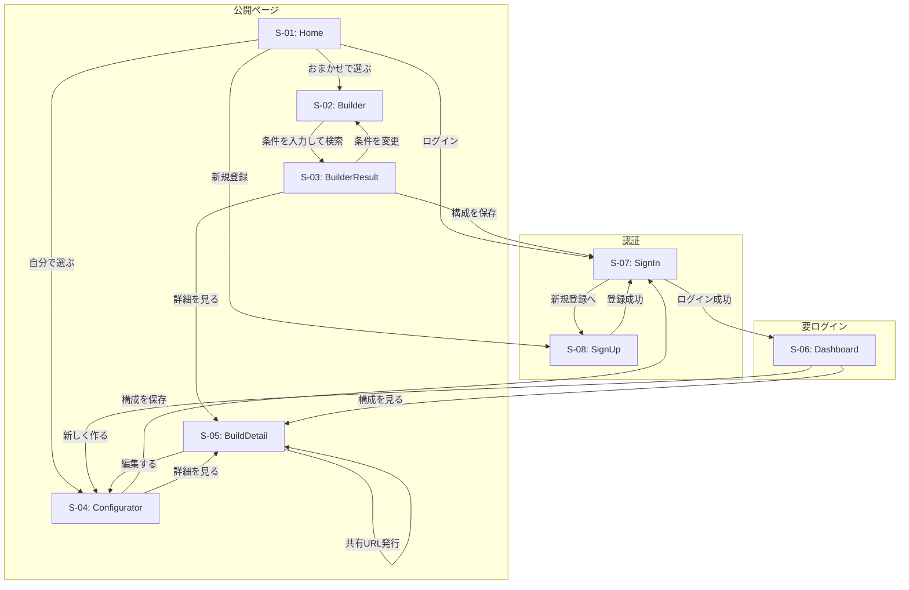
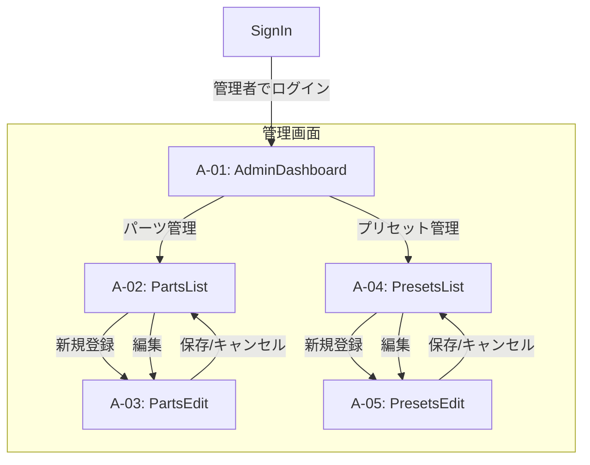
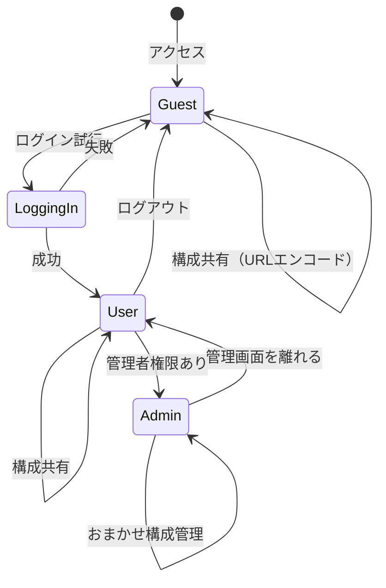

# 画面遷移図

## 1. 画面一覧

### 1.1 ユーザー向け画面

| ID | 画面名 | URL | コンポーネント |
|----|--------|-----|---------------|
| S-01 | トップページ | `/` | `page.tsx` |
| S-02 | おまかせ構成 | `/builder` | `page.tsx` |
| S-03 | おまかせ結果 | `/builder/result` | `page.tsx` |
| S-04 | カスタム構成 | `/configurator` | `page.tsx` |
| S-05 | 構成詳細 | `/builds/[id]` | `page.tsx` |
| S-06 | ダッシュボード | `/dashboard` | `page.tsx` |
| S-07 | ログイン | `/signin` | `page.tsx` |
| S-08 | 新規登録 | `/signup` | `page.tsx` |
| S-09 | 共有構成 | `/share` | `page.tsx` + `opengraph-image.tsx` |

### 1.2 管理者向け画面

| ID | 画面名 | URL | コンポーネント |
|----|--------|-----|---------------|
| A-01 | 管理ダッシュボード | `/admin` | `page.tsx` |
| A-02 | パーツ一覧 | `/admin/parts` | `page.tsx` |
| A-03 | パーツ編集 | `/admin/parts/[id]` | `page.tsx` |
| A-04 | プリセット一覧 | `/admin/presets` | `page.tsx` |
| A-05 | プリセット編集 | `/admin/presets/[id]` | `page.tsx` |

---

## 2. 画面遷移図（ユーザー向け）



---

## 3. 画面遷移図（管理者向け）



---

## 4. ユーザーフロー

### 4.1 おまかせ構成フロー（Builder）

```
1. Home（トップページ）
   ↓ 「おまかせで選ぶ」クリック
2. Builder（おまかせ構成）
   ↓ 予算・用途を選択して「検索」
3. BuilderResult（結果ページ）
   ↓ 気に入った構成を「保存」
4. SignIn（未ログイン時）
   ↓ ログイン or 新規登録
5. Dashboard
   → 保存した構成を確認
```

### 4.2 カスタム構成フロー（Configurator）

```
1. Home（トップページ）
   ↓ 「自分で選ぶ」クリック
2. Configurator（カスタム構成）
   ↓ パーツを選択
   ↓ 合計価格を確認
   ↓ 「保存」クリック
3. SignIn（未ログイン時）
   ↓ ログイン or 新規登録
4. Dashboard
   → 保存した構成を確認
```

### 4.3 構成共有フロー（ログイン不要）

```
1. Configurator or BuilderResult or BuildDetail
   ↓ 「共有」または「Xで共有」クリック
2. URLエンコードされた共有URLが生成される
   （例: /share?c=eyJjcHUiOjEsImdwdSI6MTB9）
3. OG画像が動的に生成される（構成リスト表示）
4. Xに投稿 or URLをコピー
5. 第三者がURLにアクセス
   → ログイン不要で構成を閲覧可能
   → OG画像がプレビュー表示される
```

---

## 5. 状態遷移図（認証状態）



---

## 6. 改訂履歴

| 日付 | 内容 |
|------|------|
| 2025-01-12 | 初版作成 |
| 2025-01-12 | 命名規則を更新（SignUp, Builder, Configurator等） |
| 2025-01-15 | Next.js App Router対応、共有構成ページ追加、構成共有フロー更新 |
