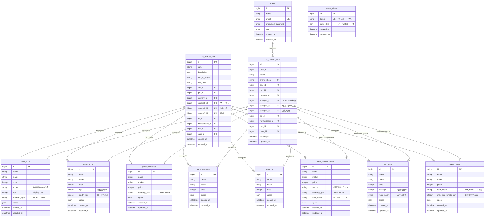

# データベース設計書

## 1. 概要

### 1.1 基本情報

| 項目 | 値 |
|------|-----|
| DBMS | MySQL 8.0 |
| 文字コード | utf8mb4 |
| 照合順序 | utf8mb4_unicode_ci |

### 1.2 テーブル一覧

| # | テーブル名 | 説明 |
|---|-----------|------|
| 1 | users | ユーザー情報 |
| 2 | parts_cpus | CPUパーツ |
| 3 | parts_gpus | GPUパーツ |
| 4 | parts_memories | メモリパーツ |
| 5 | parts_storages | ストレージパーツ |
| 6 | parts_os | OS |
| 7 | parts_motherboards | マザーボード（自動推奨） |
| 8 | parts_psus | 電源ユニット（自動推奨） |
| 9 | parts_cases | PCケース（自動推奨） |
| 10 | pc_entrust_sets | おまかせ構成（プリセット） |
| 11 | pc_custom_sets | カスタム構成 |
| 12 | share_tokens | 共有トークン（トークンベース共有用） |

---

## 2. ER図



---

## 3. テーブル定義

### 3.1 users（ユーザー）

**説明:** ユーザー情報を管理。NextAuth.js + JWT認証を使用（フロントエンド側で認証）。

| カラム名 | 型 | NULL | デフォルト | 説明 |
|----------|-----|------|-----------|------|
| id | BIGINT | NO | AUTO_INCREMENT | 主キー |
| name | VARCHAR(255) | YES | - | ユーザー名 |
| email | VARCHAR(255) | YES | - | メールアドレス |
| encrypted_password | VARCHAR(255) | NO | '' | 暗号化パスワード |
| role | VARCHAR(20) | NO | 'user' | 権限 (user/admin) |
| provider | VARCHAR(255) | NO | 'email' | 認証プロバイダ（レガシー） |
| uid | VARCHAR(255) | NO | '' | 認証UID（レガシー） |
| created_at | DATETIME | NO | CURRENT_TIMESTAMP | 作成日時 |
| updated_at | DATETIME | NO | CURRENT_TIMESTAMP | 更新日時 |

**インデックス:**
- `PRIMARY KEY (id)`
- `UNIQUE INDEX (email)`
- `UNIQUE INDEX (uid, provider)` （レガシー、将来削除予定）
- `INDEX (role)`

**注記:**
- 認証はフロントエンド（NextAuth.js）で実装。バックエンドはJWTトークンを検証
- `provider`, `uid` はDevise Token Auth時代のレガシーカラム（現在は未使用）
- 将来のマイグレーションでレガシーカラムを削除予定

---

### 3.2 parts_cpus（CPU）

**説明:** CPUパーツ情報（互換性チェック用カラム含む）

| カラム名 | 型 | NULL | デフォルト | 説明 |
|----------|-----|------|-----------|------|
| id | BIGINT | NO | AUTO_INCREMENT | 主キー |
| name | VARCHAR(255) | NO | - | 製品名 |
| maker | VARCHAR(100) | NO | - | メーカー |
| price | INTEGER | NO | 0 | 価格（円） |
| socket | VARCHAR(20) | NO | - | CPUソケット（互換性チェック用） |
| tdp | INTEGER | NO | 0 | 消費電力W（電源推奨用） |
| memory_type | VARCHAR(10) | NO | - | 対応メモリタイプ（DDR4/DDR5） |
| specs | JSON | YES | NULL | その他スペック情報 |
| created_at | DATETIME | NO | CURRENT_TIMESTAMP | 作成日時 |
| updated_at | DATETIME | NO | CURRENT_TIMESTAMP | 更新日時 |

**socketの値:** `LGA1700`, `LGA1200`, `AM5`, `AM4` 等
**memory_typeの値:** `DDR4`, `DDR5`

**specsのJSON構造例:**
```json
{
  "cores": 20,
  "threads": 28,
  "base_clock": "3.4GHz",
  "boost_clock": "5.6GHz"
}
```

**インデックス:**
- `PRIMARY KEY (id)`
- `INDEX (maker)`
- `INDEX (price)`
- `INDEX (socket)`

---

### 3.3 parts_gpus（GPU）

**説明:** GPUパーツ情報（互換性チェック用カラム含む）

| カラム名 | 型 | NULL | デフォルト | 説明 |
|----------|-----|------|-----------|------|
| id | BIGINT | NO | AUTO_INCREMENT | 主キー |
| name | VARCHAR(255) | NO | - | 製品名 |
| maker | VARCHAR(100) | NO | - | メーカー |
| price | INTEGER | NO | 0 | 価格（円） |
| tdp | INTEGER | NO | 0 | 消費電力W（電源推奨用） |
| length_mm | INTEGER | YES | NULL | カード長mm（ケース互換性用） |
| specs | JSON | YES | NULL | その他スペック情報 |
| created_at | DATETIME | NO | CURRENT_TIMESTAMP | 作成日時 |
| updated_at | DATETIME | NO | CURRENT_TIMESTAMP | 更新日時 |

**specsのJSON構造例:**
```json
{
  "vram": "16GB",
  "memory_type": "GDDR6X",
  "base_clock": "2310MHz",
  "boost_clock": "2610MHz"
}
```

**インデックス:**
- `PRIMARY KEY (id)`
- `INDEX (maker)`
- `INDEX (price)`

---

### 3.4 parts_memories（メモリ）

**説明:** メモリパーツ情報（互換性チェック用カラム含む）

| カラム名 | 型 | NULL | デフォルト | 説明 |
|----------|-----|------|-----------|------|
| id | BIGINT | NO | AUTO_INCREMENT | 主キー |
| name | VARCHAR(255) | NO | - | 製品名 |
| maker | VARCHAR(100) | NO | - | メーカー |
| price | INTEGER | NO | 0 | 価格（円） |
| memory_type | VARCHAR(10) | NO | - | メモリタイプ（DDR4/DDR5） |
| specs | JSON | YES | NULL | その他スペック情報 |
| created_at | DATETIME | NO | CURRENT_TIMESTAMP | 作成日時 |
| updated_at | DATETIME | NO | CURRENT_TIMESTAMP | 更新日時 |

**memory_typeの値:** `DDR4`, `DDR5`

**specsのJSON構造例:**
```json
{
  "capacity": "32GB",
  "speed": "5600MHz",
  "modules": "16GB x 2"
}
```

**インデックス:**
- `PRIMARY KEY (id)`
- `INDEX (maker)`
- `INDEX (price)`
- `INDEX (memory_type)`

---

### 3.5 parts_storages（ストレージ）

**説明:** ストレージパーツ情報

| カラム名 | 型 | NULL | デフォルト | 説明 |
|----------|-----|------|-----------|------|
| id | BIGINT | NO | AUTO_INCREMENT | 主キー |
| name | VARCHAR(255) | NO | - | 製品名 |
| maker | VARCHAR(100) | NO | - | メーカー |
| price | INTEGER | NO | 0 | 価格（円） |
| specs | JSON | YES | NULL | スペック情報 |
| created_at | DATETIME | NO | CURRENT_TIMESTAMP | 作成日時 |
| updated_at | DATETIME | NO | CURRENT_TIMESTAMP | 更新日時 |

**specsのJSON構造例:**
```json
{
  "capacity": "1TB",
  "type": "NVMe SSD",
  "interface": "PCIe 4.0",
  "read_speed": "7000MB/s",
  "write_speed": "5500MB/s"
}
```

**インデックス:**
- `PRIMARY KEY (id)`
- `INDEX (maker)`
- `INDEX (price)`

---

### 3.6 parts_os（OS）

**説明:** OS情報

| カラム名 | 型 | NULL | デフォルト | 説明 |
|----------|-----|------|-----------|------|
| id | BIGINT | NO | AUTO_INCREMENT | 主キー |
| name | VARCHAR(255) | NO | - | 製品名 |
| maker | VARCHAR(100) | NO | - | メーカー |
| price | INTEGER | NO | 0 | 価格（円） |
| specs | JSON | YES | NULL | スペック情報 |
| created_at | DATETIME | NO | CURRENT_TIMESTAMP | 作成日時 |
| updated_at | DATETIME | NO | CURRENT_TIMESTAMP | 更新日時 |

**specsのJSON構造例:**
```json
{
  "version": "Windows 11 Home",
  "license_type": "リテール",
  "bit": "64bit"
}
```

**インデックス:**
- `PRIMARY KEY (id)`
- `INDEX (maker)`
- `INDEX (price)`

---

### 3.7 parts_motherboards（マザーボード）【自動推奨】

**説明:** マザーボード情報。CPUソケットとメモリタイプに基づき自動推奨される。

| カラム名 | 型 | NULL | デフォルト | 説明 |
|----------|-----|------|-----------|------|
| id | BIGINT | NO | AUTO_INCREMENT | 主キー |
| name | VARCHAR(255) | NO | - | 製品名 |
| maker | VARCHAR(100) | NO | - | メーカー |
| price | INTEGER | NO | 0 | 価格（円） |
| socket | VARCHAR(20) | NO | - | 対応CPUソケット |
| memory_type | VARCHAR(10) | NO | - | 対応メモリタイプ（DDR4/DDR5） |
| form_factor | VARCHAR(10) | NO | - | フォームファクタ（ATX/mATX/ITX） |
| specs | JSON | YES | NULL | その他スペック情報 |
| created_at | DATETIME | NO | CURRENT_TIMESTAMP | 作成日時 |
| updated_at | DATETIME | NO | CURRENT_TIMESTAMP | 更新日時 |

**推奨ロジック:** `CPU.socket = motherboard.socket AND CPU.memory_type = motherboard.memory_type`

**インデックス:**
- `PRIMARY KEY (id)`
- `INDEX (socket)`
- `INDEX (memory_type)`
- `INDEX (form_factor)`

---

### 3.8 parts_psus（電源ユニット）【自動推奨】

**説明:** 電源ユニット情報。CPU+GPUのTDPに基づき自動推奨される。

| カラム名 | 型 | NULL | デフォルト | 説明 |
|----------|-----|------|-----------|------|
| id | BIGINT | NO | AUTO_INCREMENT | 主キー |
| name | VARCHAR(255) | NO | - | 製品名 |
| maker | VARCHAR(100) | NO | - | メーカー |
| price | INTEGER | NO | 0 | 価格（円） |
| wattage | INTEGER | NO | 0 | 電源容量（W） |
| form_factor | VARCHAR(10) | NO | 'ATX' | フォームファクタ（ATX/SFX） |
| specs | JSON | YES | NULL | その他スペック情報 |
| created_at | DATETIME | NO | CURRENT_TIMESTAMP | 作成日時 |
| updated_at | DATETIME | NO | CURRENT_TIMESTAMP | 更新日時 |

**推奨ロジック:** `psu.wattage >= (CPU.tdp + GPU.tdp) * 1.5`

**インデックス:**
- `PRIMARY KEY (id)`
- `INDEX (wattage)`
- `INDEX (form_factor)`

---

### 3.9 parts_cases（PCケース）【自動推奨】

**説明:** PCケース情報。マザーボードのフォームファクタに基づき自動推奨される。

| カラム名 | 型 | NULL | デフォルト | 説明 |
|----------|-----|------|-----------|------|
| id | BIGINT | NO | AUTO_INCREMENT | 主キー |
| name | VARCHAR(255) | NO | - | 製品名 |
| maker | VARCHAR(100) | NO | - | メーカー |
| price | INTEGER | NO | 0 | 価格（円） |
| form_factor | VARCHAR(10) | NO | - | 対応フォームファクタ（ATX/mATX/ITX） |
| max_gpu_length_mm | INTEGER | YES | NULL | 最大GPU長（mm） |
| specs | JSON | YES | NULL | その他スペック情報 |
| created_at | DATETIME | NO | CURRENT_TIMESTAMP | 作成日時 |
| updated_at | DATETIME | NO | CURRENT_TIMESTAMP | 更新日時 |

**推奨ロジック:**
- `case.form_factor が motherboard.form_factor に対応`
- `case.max_gpu_length_mm >= GPU.length_mm`

**インデックス:**
- `PRIMARY KEY (id)`
- `INDEX (form_factor)`
- `INDEX (maker)`
- `INDEX (price)`

---

### 3.10 pc_entrust_sets（おまかせ構成/プリセット）

**説明:** 管理者が作成するおまかせ構成（プリセット）

| カラム名 | 型 | NULL | デフォルト | 説明 |
|----------|-----|------|-----------|------|
| id | BIGINT | NO | AUTO_INCREMENT | 主キー |
| name | VARCHAR(255) | NO | - | 構成名 |
| description | TEXT | YES | NULL | 説明 |
| budget_range | VARCHAR(20) | NO | - | 予算帯 |
| use_case | VARCHAR(20) | NO | - | 用途 |
| cpu_id | BIGINT | YES | NULL | CPU（FK） |
| gpu_id | BIGINT | YES | NULL | GPU（FK） |
| memory_id | BIGINT | YES | NULL | メモリ（FK） |
| storage1_id | BIGINT | YES | NULL | プライマリストレージ（FK） |
| storage2_id | BIGINT | YES | NULL | セカンダリストレージ（FK） |
| storage3_id | BIGINT | YES | NULL | 追加ストレージ（FK） |
| os_id | BIGINT | YES | NULL | OS（FK） |
| motherboard_id | BIGINT | YES | NULL | マザーボード（FK） |
| psu_id | BIGINT | YES | NULL | 電源（FK） |
| case_id | BIGINT | YES | NULL | ケース（FK） |
| created_at | DATETIME | NO | CURRENT_TIMESTAMP | 作成日時 |
| updated_at | DATETIME | NO | CURRENT_TIMESTAMP | 更新日時 |

**budget_rangeの値:**
- `entry` - エントリー（〜10万円）
- `middle` - ミドル（10〜30万円）
- `high` - ハイエンド（30万円〜）

**use_caseの値:**
- `gaming` - ゲーミング
- `creative` - クリエイティブ（動画編集など）
- `office` - オフィス/事務作業

**インデックス:**
- `PRIMARY KEY (id)`
- `INDEX (budget_range)`
- `INDEX (use_case)`

**外部キー:**
- `cpu_id → parts_cpus(id) ON DELETE SET NULL`
- `gpu_id → parts_gpus(id) ON DELETE SET NULL`
- `memory_id → parts_memories(id) ON DELETE SET NULL`
- `storage1_id → parts_storages(id) ON DELETE SET NULL`
- `storage2_id → parts_storages(id) ON DELETE SET NULL`
- `storage3_id → parts_storages(id) ON DELETE SET NULL`
- `os_id → parts_os(id) ON DELETE SET NULL`
- `motherboard_id → parts_motherboards(id) ON DELETE SET NULL`
- `psu_id → parts_psus(id) ON DELETE SET NULL`
- `case_id → parts_cases(id) ON DELETE SET NULL`

---

### 3.11 pc_custom_sets（カスタム構成）

**説明:** ユーザーが作成するカスタムPC構成。マザーボード・電源・ケースは自動推奨で設定される。

| カラム名 | 型 | NULL | デフォルト | 説明 |
|----------|-----|------|-----------|------|
| id | BIGINT | NO | AUTO_INCREMENT | 主キー |
| user_id | BIGINT | YES | NULL | ユーザー（FK）※ゲスト共有時はNULL |
| name | VARCHAR(255) | NO | - | 構成名 |
| share_token | VARCHAR(32) | YES | NULL | 共有トークン |
| cpu_id | BIGINT | YES | NULL | CPU（FK）【ユーザー選択】 |
| gpu_id | BIGINT | YES | NULL | GPU（FK）【ユーザー選択】 |
| memory_id | BIGINT | YES | NULL | メモリ（FK）【ユーザー選択】 |
| storage1_id | BIGINT | YES | NULL | プライマリストレージ（FK）【必須】 |
| storage2_id | BIGINT | YES | NULL | セカンダリストレージ（FK）【任意】 |
| storage3_id | BIGINT | YES | NULL | 追加ストレージ（FK）【任意】 |
| os_id | BIGINT | YES | NULL | OS（FK）【ユーザー選択】 |
| motherboard_id | BIGINT | YES | NULL | マザーボード（FK）【自動推奨】 |
| psu_id | BIGINT | YES | NULL | 電源（FK）【自動推奨】 |
| case_id | BIGINT | YES | NULL | ケース（FK）【自動推奨】 |
| created_at | DATETIME | NO | CURRENT_TIMESTAMP | 作成日時 |
| updated_at | DATETIME | NO | CURRENT_TIMESTAMP | 更新日時 |

**インデックス:**
- `PRIMARY KEY (id)`
- `UNIQUE INDEX (share_token)`
- `INDEX (user_id)`

**外部キー:**
- `user_id → users(id) ON DELETE CASCADE`
- `cpu_id → parts_cpus(id) ON DELETE SET NULL`
- `gpu_id → parts_gpus(id) ON DELETE SET NULL`
- `memory_id → parts_memories(id) ON DELETE SET NULL`
- `storage1_id → parts_storages(id) ON DELETE SET NULL`
- `storage2_id → parts_storages(id) ON DELETE SET NULL`
- `storage3_id → parts_storages(id) ON DELETE SET NULL`
- `os_id → parts_os(id) ON DELETE SET NULL`
- `motherboard_id → parts_motherboards(id) ON DELETE SET NULL`
- `psu_id → parts_psus(id) ON DELETE SET NULL`
- `case_id → parts_cases(id) ON DELETE SET NULL`

---

### 3.12 share_tokens（共有トークン）

**説明:** トークンベース共有用。パーツ構成をJSONで保存し、短いURLで共有可能にする。

| カラム名 | 型 | NULL | デフォルト | 説明 |
|----------|-----|------|-----------|------|
| id | BIGINT | NO | AUTO_INCREMENT | 主キー |
| token | VARCHAR(255) | NO | - | 共有用トークン（URL用） |
| parts_data | JSON | NO | - | パーツ構成データ |
| created_at | DATETIME | NO | CURRENT_TIMESTAMP | 作成日時 |
| updated_at | DATETIME | NO | CURRENT_TIMESTAMP | 更新日時 |

**parts_dataのJSON構造例:**
```json
{
  "cpu": { "id": 1, "name": "Intel Core i7-14700K", "price": 52000 },
  "gpu": { "id": 5, "name": "GeForce RTX 4070", "price": 85000 },
  "memory": { "id": 3, "name": "DDR5-5600 32GB", "price": 18000 },
  "storage1": { "id": 10, "name": "Samsung 990 Pro 1TB", "price": 15000 },
  "storage2": null,
  "storage3": null,
  "os": { "id": 1, "name": "Windows 11 Home", "price": 15000 },
  "motherboard": { "id": 2, "name": "ASUS TUF B760M-PLUS", "price": 22000 },
  "psu": { "id": 4, "name": "Corsair RM750e", "price": 12000 },
  "case": { "id": 6, "name": "NZXT H5 Flow", "price": 13000 },
  "total_price": 232000
}
```

**インデックス:**
- `PRIMARY KEY (id)`
- `UNIQUE INDEX (token)`

**用途:**
- クエリパラメータ方式（`/share?c=...`）では長いURLになるため、SNS共有に不向き
- トークン方式（`/share/abc123`）では短いURLを生成でき、SNS共有に最適
- パーツデータをDBに保存することで、パーツ削除後も構成を表示可能

---

## 4. マイグレーション例（Rails）

### 4.1 parts_cpus

```ruby
class CreatePartsCpus < ActiveRecord::Migration[7.1]
  def change
    create_table :parts_cpus do |t|
      t.string :name, null: false
      t.string :maker, null: false
      t.integer :price, null: false, default: 0
      t.json :specs

      t.timestamps
    end

    add_index :parts_cpus, :maker
    add_index :parts_cpus, :price
  end
end
```

### 4.2 pc_custom_sets

```ruby
class CreatePcCustomSets < ActiveRecord::Migration[7.1]
  def change
    create_table :pc_custom_sets do |t|
      t.references :user, null: true, foreign_key: { on_delete: :cascade }
      t.string :name, null: false
      t.string :share_token, limit: 32
      # ユーザー選択パーツ
      t.references :cpu, foreign_key: { to_table: :parts_cpus, on_delete: :nullify }
      t.references :gpu, foreign_key: { to_table: :parts_gpus, on_delete: :nullify }
      t.references :memory, foreign_key: { to_table: :parts_memories, on_delete: :nullify }
      t.bigint :storage1_id, comment: 'プライマリストレージ（必須）'
      t.bigint :storage2_id, comment: 'セカンダリストレージ（任意）'
      t.bigint :storage3_id, comment: '追加ストレージ（任意）'
      t.references :os, foreign_key: { to_table: :parts_os, on_delete: :nullify }
      # 自動推奨パーツ
      t.references :motherboard, foreign_key: { to_table: :parts_motherboards, on_delete: :nullify }
      t.references :psu, foreign_key: { to_table: :parts_psus, on_delete: :nullify }
      t.references :case, foreign_key: { to_table: :parts_cases, on_delete: :nullify }

      t.timestamps
    end

    add_index :pc_custom_sets, :share_token, unique: true
    add_foreign_key :pc_custom_sets, :parts_storages, column: :storage1_id, on_delete: :nullify
    add_foreign_key :pc_custom_sets, :parts_storages, column: :storage2_id, on_delete: :nullify
    add_foreign_key :pc_custom_sets, :parts_storages, column: :storage3_id, on_delete: :nullify
  end
end
```

---

## 5. シードデータ例

```ruby
# db/seeds.rb

# CPUサンプル
PartsCpu.create!([
  {
    name: 'Intel Core i7-14700K',
    maker: 'Intel',
    price: 52000,
    specs: {
      cores: 20,
      threads: 28,
      base_clock: '3.4GHz',
      boost_clock: '5.6GHz',
      tdp: '125W',
      socket: 'LGA1700'
    }
  },
  {
    name: 'AMD Ryzen 7 7800X3D',
    maker: 'AMD',
    price: 58000,
    specs: {
      cores: 8,
      threads: 16,
      base_clock: '4.2GHz',
      boost_clock: '5.0GHz',
      tdp: '120W',
      socket: 'AM5'
    }
  }
])

# GPUサンプル
PartsGpu.create!([
  {
    name: 'GeForce RTX 4070',
    maker: 'NVIDIA',
    price: 85000,
    specs: {
      vram: '12GB',
      memory_type: 'GDDR6X',
      tdp: '200W'
    }
  }
])

# 管理者ユーザー
User.create!(
  name: 'Admin',
  email: 'admin@example.com',
  password: 'password123',
  role: 'admin'
)
```

---

## 6. 改訂履歴

| 日付 | 内容 |
|------|------|
| 2025-01-12 | 初版作成 |
| 2025-01-15 | パーツ互換性対応: parts_othersを分割（parts_motherboards, parts_psus, parts_cases）、CPU/GPU/メモリに互換性チェック用カラム追加 |
| 2025-01-15 | ストレージ3スロット対応: storage_idをstorage1_id, storage2_id, storage3_idに変更（プライマリ必須、他は任意） |
| 2025-01-15 | ER図: ストレージのリレーション記法を修正（`}|--o|` → `||--o{`） |
| 2026-02-01 | share_tokensテーブル追加（トークンベース共有用）、usersテーブル説明をNextAuth.js + JWT認証に更新、レガシーカラムに関する注記追加 |
